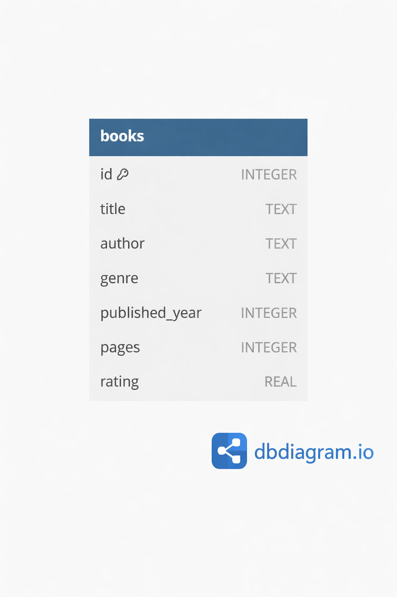

# SQL Practice Tasks – Books Database

These tasks are designed to help you practise writing SQL queries using:

* `SELECT`
* `WHERE`
* comparison operators (=, >, <)
* `AND` / `OR`
* `LIKE`
* `ORDER BY`
* `LIMIT`

You will use a single table called `books` - this was created from real book data pulled from the OpenBooks API (note that page count and rating are spoofed!)

---

## Easy Tasks

1. Show all columns for all books.
2. Show the title and author of every book.
3. Show all books published after 2015.
4. Show all books with more than 400 pages.
5. Show all books with a rating of 4.0 or higher.
6. Show all books in the `Fantasy` genre.
7. Show all books published before the year 2000.
8. Show all books with fewer than 300 pages.

---

## Medium Tasks

9. Show books that are in the `Science Fiction` genre **and** have a rating higher than 4.0.
10. Show books published before 2000 **and** with fewer than 300 pages.
11. Show books that are in the `Fantasy` genre **or** the `Romance` genre.
12. Show books with a rating below 3.5 **or** more than 700 pages.
13. Show books with a title that starts with `The`.
14. Show books where the author’s name contains the letter `a`.
15. Show all books ordered by published year from oldest to newest.
16. Show all books ordered by rating from highest to lowest.
17. Show all mystery books ordered alphabetically by title.

---

## Hard Tasks

18. Show the top 5 highest-rated books.
19. Show the 3 most recently published books.
20. Show the 10 shortest books by page count.
21. Show the top 5 highest-rated books published after 2010.
22. Show fantasy books with more than 500 pages, ordered by rating (highest first).
23. Show books published before 1980 with more than 300 pages, ordered by published year.
24. Show the 5 lowest-rated books in the `Mystery` genre.
25. Show science fiction books published after 2000, ordered by published year, limited to 5 results.

---

## Extension

Read these statements and work out the right query to solve each problem:

1.  Expanding a genre collection

A library manager wants to identify popular fantasy books to guide future purchases.
They only want to see fantasy books with a rating of 4.0 or higher, ordered so the highest-rated books appear first, and limited to the top 5 results.

2. Promoting newer books

The library is running a display of modern science fiction.
The librarian wants a list of science fiction books published after 2010, ordered from newest to oldest, showing only the first 5 books.

3. Finding short recommendations

A reading group is looking for shorter books to fit into a busy schedule.
They want to see the 10 shortest books in the database, regardless of genre.

4. Reviewing older stock

The library is reviewing older books that may need replacing.
They want to find books published before 1950 that have more than 300 pages, ordered from oldest to newest.

5. Analysing genre performance

Note: you're going to have to do a little bit of research for this one as it uses something we will look at next session!

The library manager wants to understand which genres are performing best overall.
They want to see the average rating for each genre in the database, with the highest-rated genres appearing first.