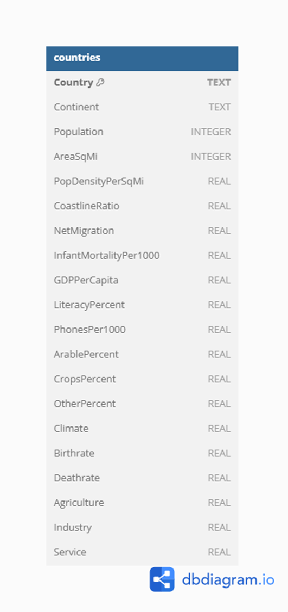

# Task 1

## Exercises
1. Find the average population for each continent.
2. Find the total population of each continent.
3. Find the largest population of any country in each continent.
4. Find the smallest land area (AreaSqMi) of any country in each continent.
5. Count how many countries there are in each continent.
6. List continents ordered by their average GDP per capita, highest first.
7. Show the top 5 most populous countries.
8. Show the 5 countries with the lowest infant mortality rate.
9. Find the average literacy rate per continent, ordered from lowest to highest.
10. Show the 3 continents with the highest total population.
11. Find the average population per continent, considering only countries with a population greater than 10 million.
12. Find the average GDP per capita per continent, considering only countries where literacy is above 80%.
13. For each continent, find the maximum birthrate of countries which an infant mortality below 30 per 1000 births.
14. Find continents where the average GDP per capita is greater than 10,000, considering only countries with a literacy rate above 80%, and order the results from highest to lowest average GDP per capita.
15. Find continents that have a total population greater than 500 million, but only include countries where the birthrate is below 20, order the results by total population (largest first), and limit the output to 3 results.

## Diagram

