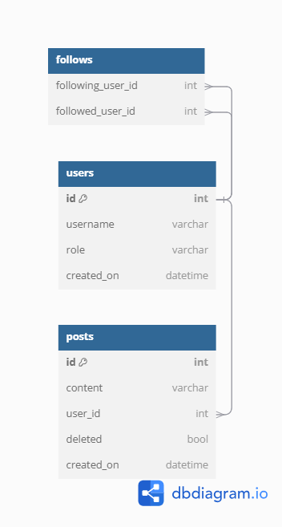

# Task 2

## Exercises

1. List all posts that have been deleted.
2. List all users whose usernames begin with 'a'.
3. Find all posts and the usernames of those who posted them whose content contains the word "small".
4. Return each non-deleted post and the username of the person who wrote in, in date order.
5. For each user, return their username and the total number of posts they have made.
6. Modify the previous query to return only users who have authored more than 3 posts.
7. For each user, return their username and the number of users they follow, including users who follow no one.
8. List the top 5 most-followed users.
9. Return a list showing the username of the follower and the username of the followed user for each follow relationship.
10. For a given user (christopherprice), return all non-deleted posts written by users they follow, ordered from most recent to oldest.

## Diagram

