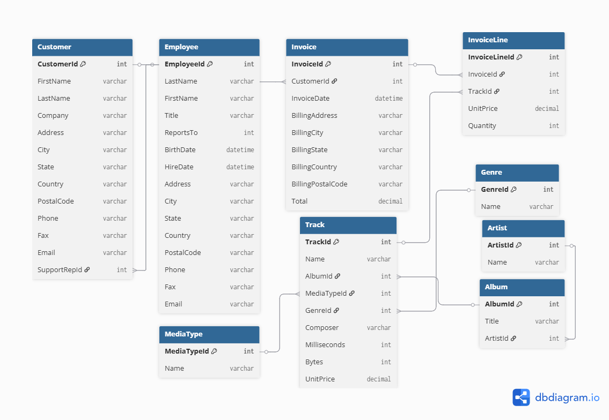

# Practice - Task 3

Chinook is a large opensource dataset which is a mock online record store, with ecommerce and music data. It has several tables, and is larger than what you have used so far - you will want to look at the database diagram to help you map out the relationships between tables!

You may need to do some multiplication for some of these - you can use * inside of another aggregator (for example: `SUM(quantity * price)`).

## Exercises

1. List all tracks along with their album title and artist name.
2. List all albums along with the name of the artist.
3. For each genre, list the number of tracks available.
4. List the total duration (milliseconds) of tracks per genre.
5. For each media type, count the number of tracks.
6. Find the total number of tracks per album.
7. Find the average price of tracks per genre.
8. List all tracks along with genre, album, and artist name.
9. Find the top 5 albums with the most tracks.
10. Find the top 5 artists with the most albums.
11. For each genre, find the total revenue generated from sales.
12. Find the top 5 genres by total revenue.
13. For each artist, calculate the total number of tracks sold and total revenue from sold tracks.
14. List albums with at least one track sold and total revenue from sold tracks.
15. Find the top 5 artists by total revenue.
16. For each media type, calculate the total revenue generated from tracks that have been sold.
17. For each genre, find the average track price and total number of tracks.
18. List the 10 tracks sold in the smallest quantities (tracks with at least one sale).
19. Find the top 10 tracks by total revenue.
20. For each artist, find the average track price and total number of tracks sold.

# Diagram

